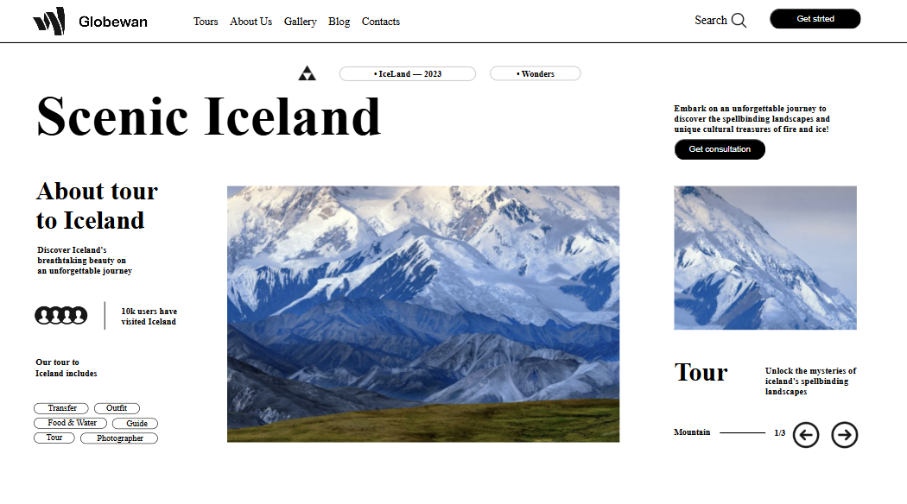
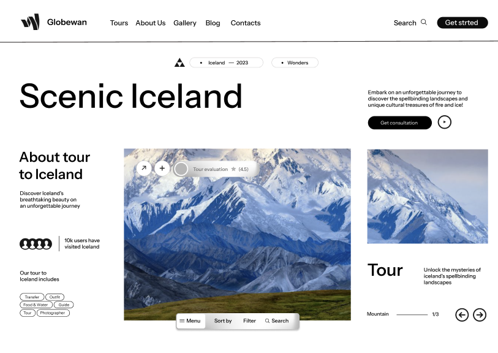

# Landing Page - Iceland

1920x1080

## Landing Page - FIGMA

## Sobre
Site do tipo landing Page para divulgar um passeio nas montanhas de gelo/neve. O intuito desse projeto é colocar em prática o conhecimento adquirido sobre as linguagens de marcação, HTML, CSS e Markdown, realizadas no curso técnico de desenvolvimento de sistemas [SENAI JANDIRA](https://sp.senai.br/unidade/jandira/) 
___

## Tecnológias utlizadas
- HTML
- CSS
- Markdown
- Git
___
## Autor
LinkedIn -> [Giovanna Coelho](https://www.linkedin.com/in/giovanna-gilio-479505327/)
